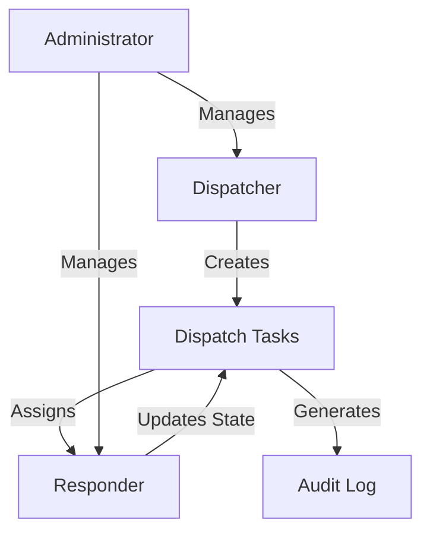

# Mega Dispatch Manager

A decentralized task routing and tracking system built on the Stacks blockchain, enabling secure, role-based dispatch management across organizational networks.

## Overview

Mega Dispatch Manager is a blockchain-powered platform that provides a robust, transparent, and secure mechanism for task allocation, tracking, and management. By leveraging the immutability and transparency of blockchain technology, the system creates a trustless environment for task coordination across diverse roles and organizational boundaries.

### Key Features

- Role-based task routing
- Granular state tracking
- Immutable task audit trail
- Flexible priority management
- Decentralized task assignment
- Comprehensive state transition controls

## Architecture

The system is built around a core smart contract that manages users, tasks, state transitions, and audit logging. The architecture follows a role-based dispatch model with three primary actors: administrators, dispatchers, and responders.



### Core Components

1. **User Management**
    - Role-based registration
    - Account status tracking
    - Permission management

2. **Task Management**
    - Task creation
    - State tracking
    - Priority assignment

3. **State Transition System**
    - Controlled state changes
    - Role-specific permissions
    - Audit logging

4. **Audit System**
    - Comprehensive task tracking
    - State change logging
    - Transparency and accountability

## Contract Documentation

### Dispatch Manager Contract

The primary contract (`dispatch-manager.clar`) handles all core functionality:

#### Key Functions

**User Operations**
- `register-user`: Register users with specific roles
- `set-admin`: Change contract administrator

**Task Operations**
- `create-task`: Create a new dispatch task
- `update-task-state`: Modify task state with audit logging

#### Roles

- `ROLE-ADMIN`: System administrators
- `ROLE-DISPATCHER`: Task creators and assigners
- `ROLE-RESPONDER`: Task executors

## Getting Started

### Prerequisites

- Clarinet CLI
- Stacks wallet
- Basic blockchain development knowledge

### Installation

1. Clone the repository
```bash
git clone <repository-url>
cd mega-dispatch-manager
```

2. Install dependencies
```bash
clarinet install
```

3. Run tests
```bash
clarinet test
```

## Function Reference

### Task Management

```clarity
(create-task 
  (title (string-utf8 100))
  (description (string-utf8 500))
  (assigned-to principal)
  (priority uint))
```
Creates a new dispatch task with specified parameters.

```clarity
(update-task-state 
  (task-id uint)
  (new-state uint)
  (reason (string-utf8 200)))
```
Updates task state with a reason, supporting controlled transitions.

## Development

### Testing

The contract includes comprehensive test scenarios:

1. User role registration
2. Task creation workflows
3. State transition validations
4. Role-based access controls
5. Audit logging verification

### Local Development

1. Start Clarinet console:
```bash
clarinet console
```

2. Deploy contract:
```bash
clarinet deploy
```

## Security Considerations

### Access Control
- Strict role-based permissions
- Controlled state transitions
- Immutable audit logging

### Task Management
- Transparent task lifecycle
- Granular state tracking
- Prevent unauthorized state changes

### Known Limitations
- Fixed set of predefined roles
- No external system integrations
- State transitions require on-chain confirmation